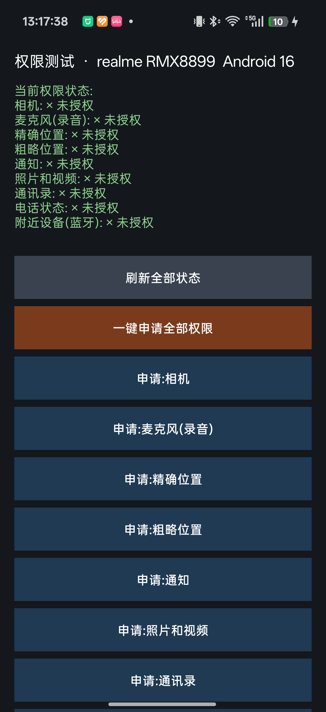

# 权限测试 (Android Permission Tester)

一个用于测试 Android 危险权限授权流程的轻量工具 App。无需 Gradle、无需 Android Studio 图形界面,纯命令行构建,单文件源码,适合真机调试环境验证、权限行为研究或作为命令行构建 Android APK 的最小示例。

<p align="center">
  
</p>

## 功能特性

- **逐项申请**:9 项危险权限各自独立按钮,点击即弹出系统授权对话框,结果实时回显
- **一键全申请**:自动跳过已授权项,把剩余权限的授权弹窗排队申请
- **状态总览**:启动时与每次操作后自动刷新,显示 √ 已授权 / × 未授权
- **永久拒绝识别**:检测"一律不允许"状态,提示并支持一键跳转系统应用设置页恢复
- **深色界面**:所有颜色硬编码,不依赖系统主题,任何机型上显示一致

## 覆盖的运行时权限

| 权限 | API 级别要求 |
|---|---|
| 相机 CAMERA | API 26+ |
| 麦克风/录音 RECORD_AUDIO | API 26+ |
| 精确位置 ACCESS_FINE_LOCATION | API 26+ |
| 粗略位置 ACCESS_COARSE_LOCATION | API 26+ |
| 通知 POST_NOTIFICATIONS | Android 13+ |
| 照片和视频 READ_MEDIA_IMAGES | Android 13+(旧版本回退 READ_EXTERNAL_STORAGE) |
| 通讯录 READ_CONTACTS | API 26+ |
| 电话状态 READ_PHONE_STATE | API 26+ |
| 附近设备/蓝牙 BLUETOOTH_CONNECT | Android 12+ |

> 注:本工具只申请权限并显示授权结果,**不会实际调用相机、录音等任何敏感能力**。

## 环境要求

- minSdk 26(Android 8.0)+,targetSdk 35(Android 15),已在 Android 16 真机验证
- 构建依赖:Android SDK(build-tools 35.0.0、platform android-35)+ JDK 21,全程命令行,**不需要 Gradle**

## 命令行构建

```bat
:: 1. 生成 APK 骨架(清单文件 + 无资源)
aapt2 link -o base.apk -I "%LOCALAPPDATA%\Android\Sdk\platforms\android-35\android.jar" --manifest AndroidManifest.xml

:: 2. 编译 Java 源码(以 android.jar 为编译类路径)
javac -encoding UTF-8 -source 1.8 -target 1.8 -bootclasspath "%LOCALAPPDATA%\Android\Sdk\platforms\android-35\android.jar" -d classes MainActivity.java

:: 3. 打包 class 并转换为 DEX
jar cf classes.jar -C classes .
d8 --release --lib "%LOCALAPPDATA%\Android\Sdk\platforms\android-35\android.jar" --min-api 26 --output . classes.jar

:: 4. DEX 塞进 APK,对齐
aapt add base.apk classes.dex
zipalign -f 4 base.apk aligned.apk

:: 5. 签名(首次可用 keytool 生成调试密钥库)
apksigner sign --ks "%USERPROFILE%\.android\debug.keystore" --out permtest.apk aligned.apk
```

## 安装运行

```bat
adb install -r permtest.apk
```

也可以直接下载本仓库中的 [permtest.apk](permtest.apk) 安装体验。

## 适用场景

- 新手机到手后验证各权限授权弹窗行为(不同厂商 ROM 弹窗样式/选项不同)
- 应用开发时对比参考"权限申请→回调→状态刷新"的最小实现
- 学习 aapt2 / javac / d8 / zipalign / apksigner 纯命令行构建 Android APK 的完整流程

## License

[MIT](LICENSE)
